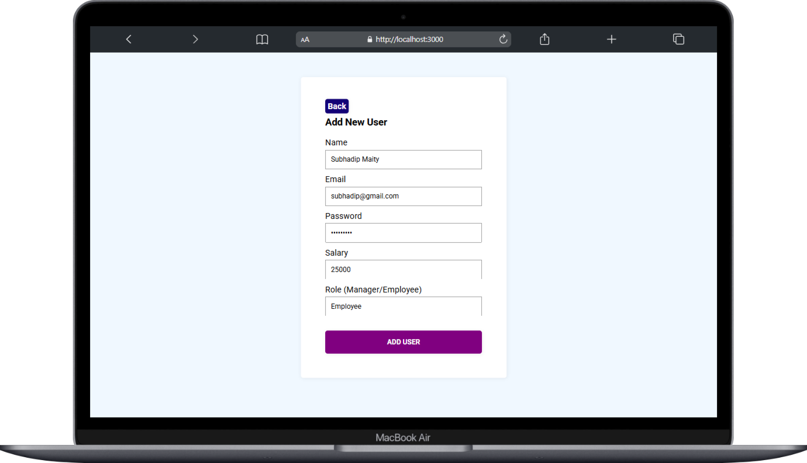

# User Management System

## By, Subhadip Maity.

## Description
This project is a simple **User Management System** built with a React frontend and Express backend. The system allows users to perform basic CRUD (Create, Read, Update, Delete) operations on user data, including `name`, `email`, `password`, `salary`, and `role`.

## Table of Contents
- [Installation](#installation)
- [Usage](#usage)
- [Features](#features)
- [Technologies Used](#technologies-used)
- [Images](#images)
- [Notes](#notes)
- [Contact](#contact)

## Installation
### Clone the repository:
```sh
git clone https://github.com/SontuCoder/Employee-Management-System.git
```
### Install dependencies:
#### Backend:
```sh
cd server
npm install
```
#### Frontend:
```sh
cd client
npm install
```

### Setup environment variables:
In the `backend` folder, create a `.env` file and set the following environment variables:

### Run the backend:
```sh
cd server
nodemon start
```

### Run the frontend:
```sh
cd client
npm run start
```

## Usage
The system provides the following API endpoints:
- **POST** `/user/create` - Create a new user.
- **GET** `/user/getAll` - Get a list of all users.
- **GET** `/user/getUser/:id` - Get a specific user by ID.
- **PUT** `/user/update/:id` - Update a user's details.
- **DELETE** `/user/delete/:id` - Delete a user by ID.

## Features
- Add new users with details such as name, email, password, salary, and role(By default Employee).
- Update user information.
- Delete users from the system.
- Retrieve and display a list of all users.
- Show detailed information for a single user.
- Toast notifications for success and error messages.

## Technologies Used
### Frontend
- **React** - UI framework for building the frontend.
- **React Router** - For navigation between pages.
- **Axios** - For making HTTP requests.
- **React Hot Toast** - For displaying notifications.


### Backend
- **Node.js** - Runtime environment.
- **Express.js** - Web framework for API development.
- **MongoDB** - Database for storing user information.
- **Mongoose** - ODM for MongoDB.


## Images
- New user Add form


- Employee Tables


## Notes
### Future Enhancements
- Add pagination for large datasets.
- Implement user authentication and authorization.
- Add search and filtering functionality.
- Improve UI with a more responsive and modern design.

## Contact
- Email: [subhadipmaity792@gmail.com](mailto:subhadipmaity792@gmail.com)
- GitHub: [SontuCoder](https://github.com/SontuCoder)

